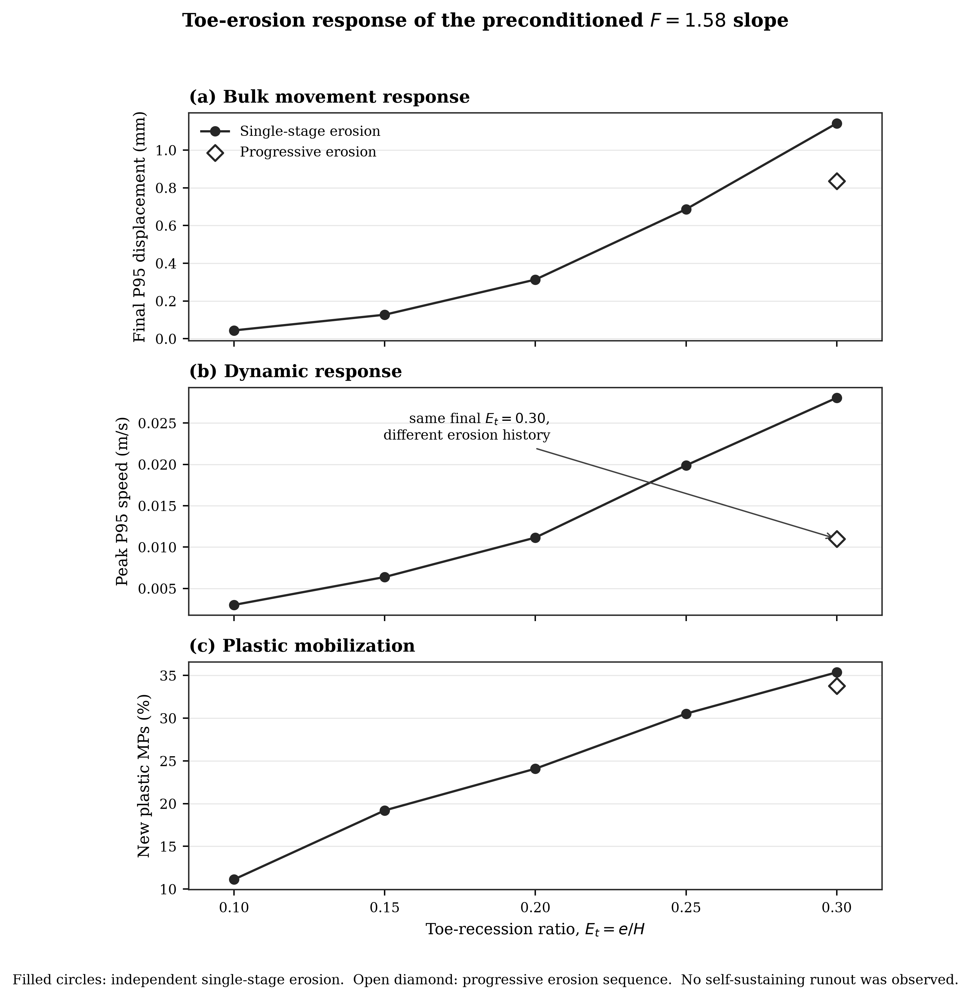
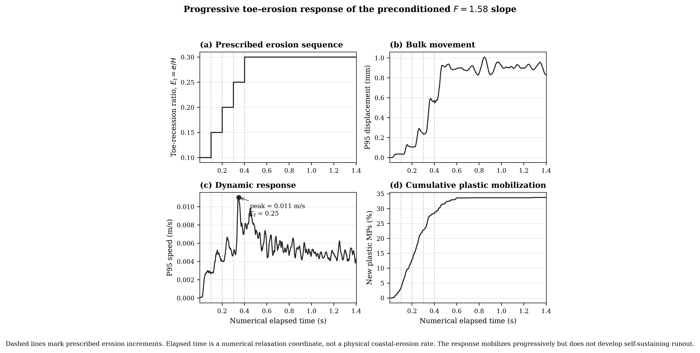

# SlopeMPM

## Large-Deformation Modelling of Hydrologically Informed Slope Weakening and Progressive Toe Erosion

**Research question:**  
*How do hydrologically informed soil weakening and progressive toe erosion interact to control slope mobilization and post-disturbance response?*

SlopeMPM is a two-dimensional Material Point Method (MPM) study of an idealized cohesive-frictional slope subjected to near-critical strength weakening and prescribed toe recession.

The project asks three main questions:

1. Can the slope establish a mechanically stable self-weight state?
2. How close can the material state approach a model-specific strength transition while remaining equilibrated?
3. How does increasing or progressive toe recession change displacement, velocity, and plastic mobilization?

The simulations use **Kratos Multiphysics MPMApplication** with Mohr-Coulomb plasticity under plane-strain conditions.

> **Scope:** hydrological effects are represented through independently preconditioned strength states. This is not a transient rainfall-infiltration model. Toe erosion is represented by prescribed geometric material-point removal and does not resolve waves, sediment transport, or fluid-soil interaction.

---

## Why MPM?

Large soil movement can be difficult for conventional mesh-based methods because the computational mesh may distort severely.

The Material Point Method separates:

- **material points**, which carry the soil state, and
- a **background grid**, which is used to solve the governing equations.

This makes MPM attractive for large-deformation problems such as slope failure and post-failure movement.

In the present slope experiments, the response remains in the mobilization regime rather than developing self-sustaining runout. Large-deformation MPM capability is independently demonstrated through reproduction of an upstream granular-collapse benchmark.

---

## Computational workflow

The study follows a verification-first workflow:

    Kratos MPM environment
            ↓
    upstream granular-collapse benchmark
            ↓
    independent slope geometry
            ↓
    dry/intact self-weight equilibrium
            ↓
    incremental strength-reduction screening
            ↓
    preconditioned near-transition strength state
            ↓
    dynamic restart verification
            ↓
    single-stage toe erosion
            ↓
    progressive toe erosion
            ↓
    response and relaxation analysis

The slope geometry uses:

- height $H = 10$ m,
- slope inclination $30^\circ$,
- 3,570 initial material points,
- Mohr-Coulomb plasticity,
- plane-strain constitutive response.

---

## 1. Verified dry/intact equilibrium

The dry/intact slope reaches a stable self-weight equilibrium.

| Quantity | Result |
|---|---:|
| Material points | 3,570 |
| Body area | 146.603 m² |
| Weight | 2,876.342 kN/m |
| Bottom reaction | 2,876.343 kN/m |
| Force-balance error | approximately 0% |
| Mean displacement | 11.811 mm |
| P95 displacement | 24.459 mm |
| Maximum displacement | 25.703 mm |
| Maximum equivalent plastic strain | 0 |
| Plastic MPs above $10^{-4}$ | 0% |

The baseline therefore provides a mechanically stable reference state for the weakening and erosion experiments.

---

## 2. Near-transition strength state

Strength screening uses

$$
c_F = \frac{c_0}{F}
$$

and

$$
\tan \phi_F = \frac{\tan \phi_0}{F}.
$$

Here:

- $c$ is cohesion: the bonding contribution to shear strength,
- $\phi$ is friction angle: the frictional contribution to shear resistance,
- $F$ is the numerical strength-reduction factor.

**The strength-reduction factor is not interpreted as a physical factor of safety.**

Under the common incremental gravity-ramp setup and a 100-iteration Newton budget:

- $F=1.58$ reaches full self-weight equilibrium.
- $F=1.59$ does not converge at the final full-gravity increment.

The model-specific equilibrium transition is therefore bracketed by

$$
1.58 < F_{\mathrm{transition}} \leq 1.59.
$$

The equilibrated $F=1.58$ case is selected as the near-transition preconditioned weakened state.

A short dynamic continuation shows that this state does not spontaneously mobilize after the quasi-static pseudo-velocity is removed.

---

## 3. Prescribed toe recession

Toe recession is parameterized by

$$
E_t = \frac{e}{H},
$$

where:

- $e$ = horizontal toe recession,
- $H = 10$ m = slope height.

For example,

$$
E_t=0.10
$$

corresponds to a 1.0 m toe recession.

Material points inside the prescribed toe wedge are removed using the Kratos MPM material-point erase mechanism.

Each **single-stage** experiment starts independently from the same equilibrated $F=1.58$ state.

---

## 4. Increasing toe recession increases mobilization

| $E_t$ | Toe recession | Final P95 displacement | Peak P95 speed | New plastic MPs |
|---:|---:|---:|---:|---:|
| 0.10 | 1.0 m | 0.044 mm | 0.00301 m/s | 11.13% |
| 0.15 | 1.5 m | 0.127 mm | 0.00639 m/s | 19.20% |
| 0.20 | 2.0 m | 0.313 mm | 0.01115 m/s | 24.09% |
| 0.25 | 2.5 m | 0.686 mm | 0.01989 m/s | 30.53% |
| 0.30 | 3.0 m | 1.142 mm | 0.02805 m/s | 35.36% |

Increasing prescribed toe recession systematically increases:

- bulk displacement,
- transient velocity response,
- and plastic mobilization.

However, all tested single-stage cases show an early velocity peak followed by decay rather than sustained acceleration.

**No self-sustaining runout is observed.**

---

## 5. Erosion history matters

A second experiment reaches the same final geometry progressively:

$$
E_t =
0.10
\rightarrow
0.15
\rightarrow
0.20
\rightarrow
0.25
\rightarrow
0.30.
$$

The intervals between erosion stages are numerical relaxation intervals and are **not interpreted as a physical coastal-erosion rate**.

At the same final $E_t=0.30$:

| Metric | Single-stage | Progressive |
|---|---:|---:|
| Final P95 displacement | 1.142 mm | 0.836 mm |
| Peak P95 speed | 0.02805 m/s | 0.01100 m/s |
| New plastic MPs | 35.36% | 33.76% |

Instantaneous removal therefore produces a substantially stronger transient response than reaching the same final toe geometry progressively.

The lower progressive response is **consistent with stress redistribution and relaxation between erosion increments**, although the simulations do not independently prove that mechanism.

---

## 6. Mobilization is not the same as failure

A central modelling distinction in this study is between **plastic mobilization** and **self-sustaining failure**.

### Plastic mobilization

Parts of the soil undergo irreversible deformation.

### Self-sustaining failure

Movement continues or accelerates without requiring an additional imposed disturbance.

The progressive case reaches approximately **33.8% newly plastic material points**, yet its velocity response decreases after the final erosion stage.

In the extended relaxation calculation:

- peak post-$E_t=0.30$ P95 speed: $9.83\times10^{-3}$ m/s,
- final P95 speed: $4.31\times10^{-3}$ m/s,
- final/peak speed ratio: 0.438,
- late-time speed ratio: 0.897.

The model therefore develops substantial plastic mobilization without transitioning to runaway motion.

---

## Main finding

> **Hydrologically informed strength weakening places the model slope close to an equilibrium transition, while increasing prescribed toe recession progressively increases displacement, dynamic response, and plastic mobilization. Within the tested range, however, neither single-stage nor progressive toe recession up to $E_t=0.30$ produces self-sustaining landslide runout.**

The simulations distinguish between

$$
\text{stable state}
\rightarrow
\text{mobilization}
\rightarrow
\text{plastic yielding}
$$

and the stronger condition

$$
\text{self-sustaining large-deformation failure}.
$$

---

## Verification and reproducibility

The workflow includes:

- environment verification,
- reproduction of an upstream Kratos MPM granular-collapse example,
- independent slope geometry checks,
- self-weight force-balance verification,
- static versus quasi-static baseline comparison,
- incremental strength screening,
- restart-state verification,
- dynamic zero-disturbance checks,
- automated displacement, velocity, plasticity, and downslope-response extraction.

Detailed numerical results:

[docs/results_summary.md](docs/results_summary.md)

Processed erosion summary:

[results/final_erosion_summary.csv](results/final_erosion_summary.csv)

---

## Repository structure

    slope-mpm-runout/
    ├── benchmark/      upstream benchmark reproduction
    ├── docs/           scientific results summary
    ├── results/        processed tables and final figures
    ├── scenarios/      reproducible simulation cases
    └── src/            builders, diagnostics, and plotting tools

Raw VTK and restart outputs are intentionally excluded from version control because they are large and reproducible from the supplied case definitions.

---

## Scientific limitations

This project intentionally does **not** claim:

- fully coupled rainfall infiltration,
- transient saturation evolution,
- wave-resolved coastal erosion,
- experimental validation,
- a formal physical factor of safety,
- or landslide runout in the slope scenarios.

Instead, it isolates a smaller mechanistic question:

> **How does a preconditioned weakened slope respond as toe support is progressively removed?**

The workflow provides a reproducible foundation for future coupled hydro-mechanical and large-deformation modelling.
